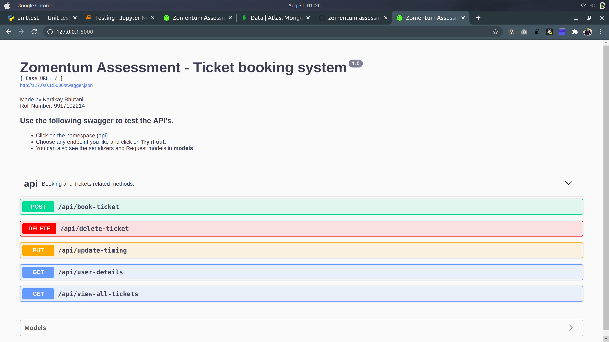
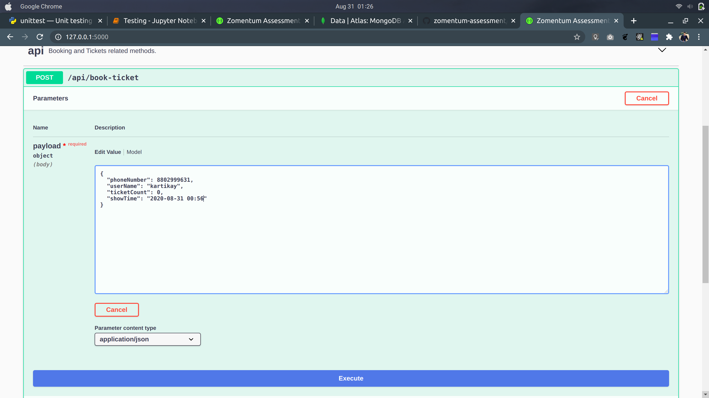
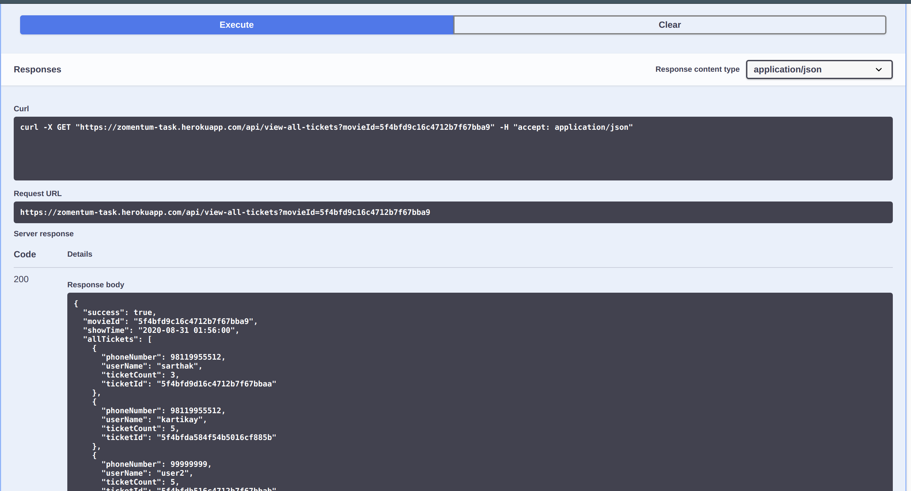
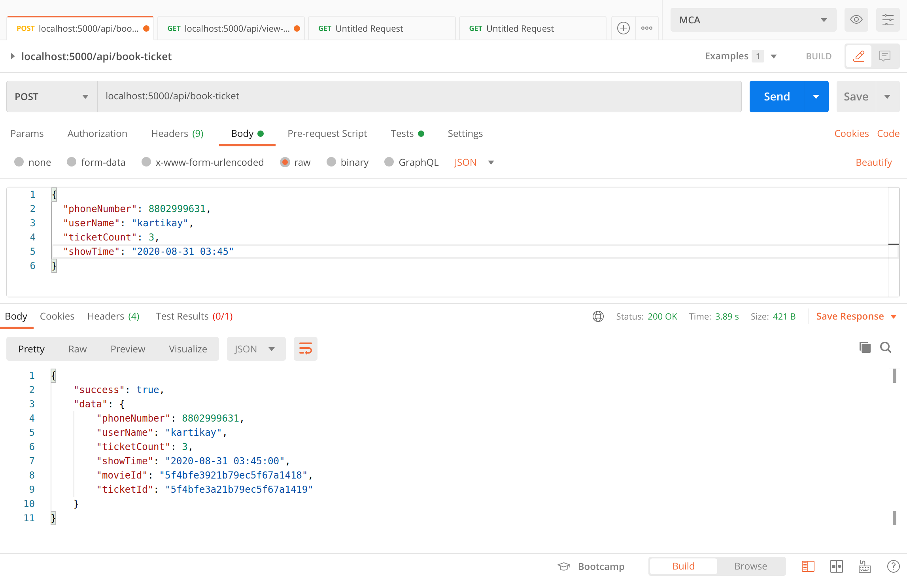
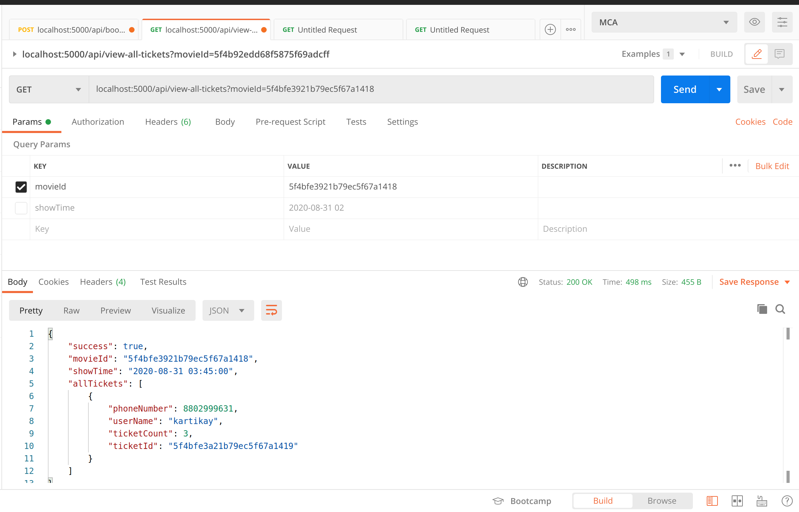

# Zomentum Assessment - REST API's for ticket booking system

## Deployed version - https://zomentum-task.herokuapp.com/

## Installation

The rest API's are built using Python, Flask, flask_restx and MongoDb. To set up the project locally, follow the steps below

Set up a virtual environment using `virtualenv .venv` and start it using `source .venv/bin/activate`

Once that is done, use `pip install -r requirements.txt` to install all of the dependencies. If you want to use your own local MongoDb instance, you can replace the testing database URI with yours in `config.py`.

If you are using local MongoDb instance, you have to run for the very first time `initDb.py` using `Python initDb.py` to initialize collections and TTL Indexes for Auto deletions of expired documents. The testing Database already has this step done.

If you want to use authentications for all of the endpoints, you can set `apiAuth` to `True` in `config.py`. Now all of the endpoints will require the `X-Auth-Token` in their headers.

use `flask run` to start a server at port 5000

## API endpoints and functionalities

- #### Endpoint to Book ticket
    `/api/book-ticket`  can be used to Book a ticket. If the Movie for passed show timing doesn't exists, it creates a new Movie in Movies Collection.
    Before booking the ticket, it checks for `ticketCount` which cannot exceed 20.  
- #### Update timing of ticket
    `api/update-timing` can be used to update the timing of ticket.

- #### View All tickets
    `/api/view-all-tickets` can be used to view all tickets booked for a movie. Either `showTiming` or `movieId` any of these can be used to check all tickets for a particular movie.

- #### Delete a ticket
    `/api/delete-ticket` can be used to delete a ticket using it's `ticketId`

- #### View User Details associated with a ticket
    `/api/user-details` can be used to see details of the user who booked the ticket using `ticketId`

- #### Mark Ticket Expired after 8 hours and Deletion
    This part is being handled by MongoDb **TTL index** that sets Time to live for each document. Since mongodb checks for UTC Time, the `expireAfter` time for each documents is set to 2.5 hours (8 - 5.5) since IST is ahead by 5.5 hours.
    MongoDb automatically checks for expired tickets every 1 minute and deletes the one whose `showTiming` is more than current time.

## Testing

Manual Testing can be done using the Swagger UI or Postman. For automated Unit testing, run `python test_api.py`.

### Testing through Swagger UI

You can visit https://zomentum-task.herokuapp.com/ in deployed version or `http://127.0.0.1:5000/` in locally set up version to see the Swagger UI. The endpoints for the namespace `api` are listed under it and the serializer and models are under `models`.

To test any api, select it in the swagger UI as shown in the screenshot and click `Try it now`. You can see the expected payload under `Example value` and `Model`.

To test the API and send data, Edit the values after clicking `Try it now` and enter the payload data. Once done, click `Execute` to do the request as shown in screenshot.

The `Response body, header` and `Status code` can be seen just below it.

### Testing through postman

For testing through postman, you can use this [link](https://www.getpostman.com/collections/1dd9f6ca302b465f5cfd) or use the JSON file in `Postman Collection` directory.

Sample Payload and response for few endpoints is shown below.

